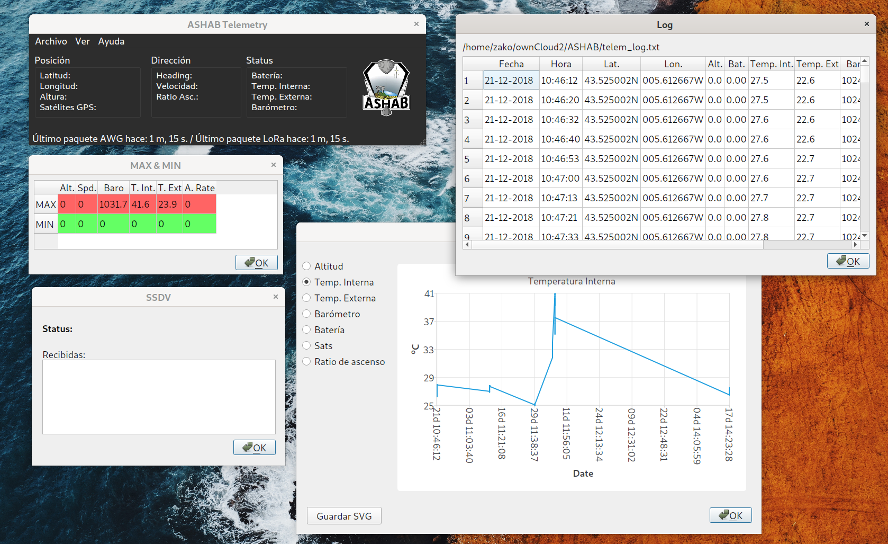

# ASHAB-Telemetry

Qt client application for ASHAB Balloon telemetry.
Reads LoRa packets (telemetry and SSDV) from serial port using ASHAB-Telemetry-Receiver device/firmware.



# Installation

Install qt5, qtsvg qtserial, qtchart and development libraries, in debian/ubuntu for example:
```
$ sudo apt install qt5-default qt5-qmake libqt5svg5-dev libqt5charts5-dev libqt5serialport5-dev
```

Build the project from the downloaded directory:

```
$ qmake
$ make
```
Then you can run the software from the project directory:

```
$ ./ASHABTelemetry
```

The first time you run it, you must open the configuration dialog and fill the basic parameters, serial port for the LoRa receiver, log file location and SSDV received pictures folder, if not, some functions will not work.


